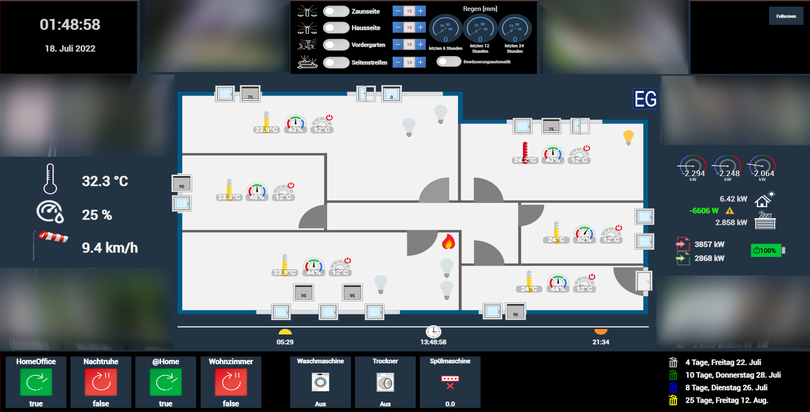
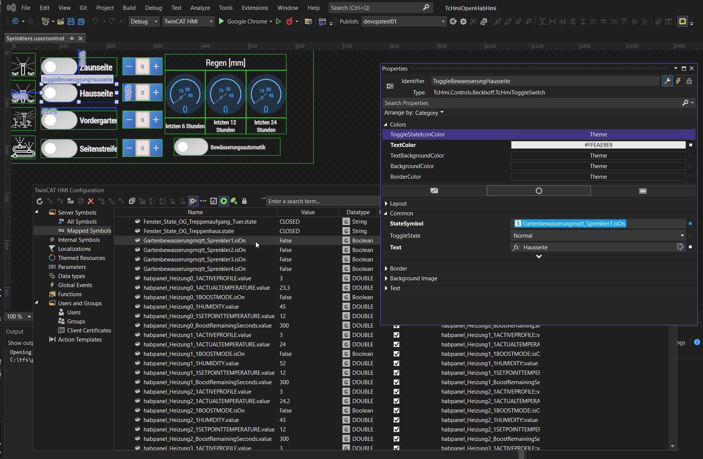
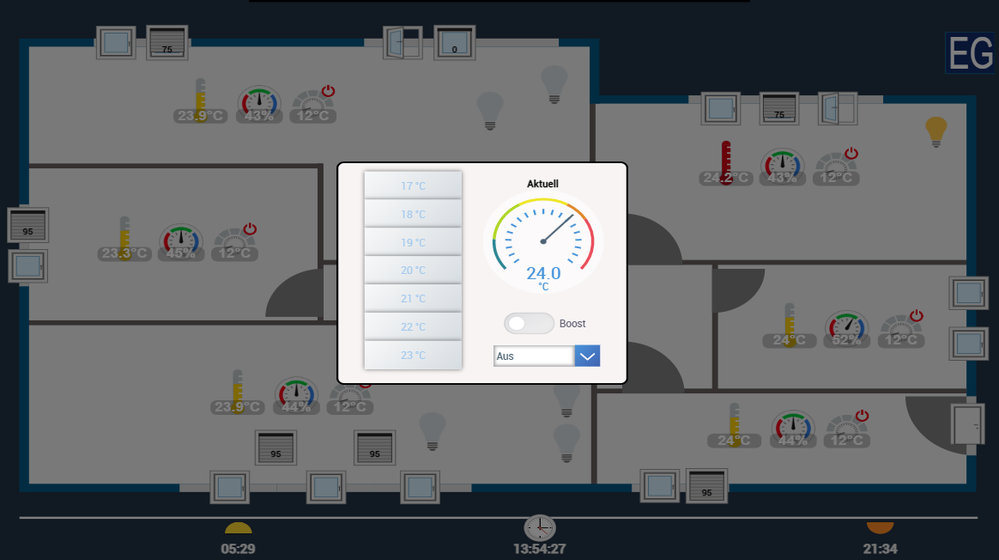
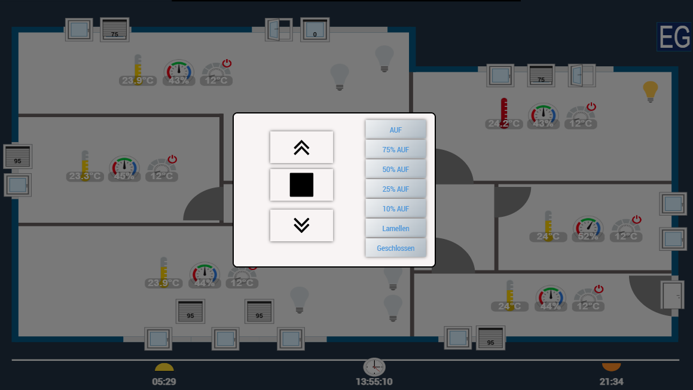
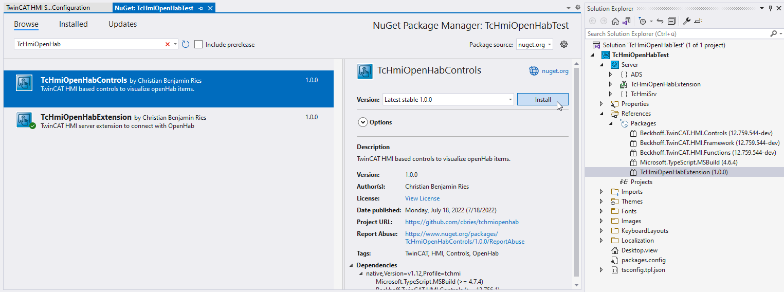
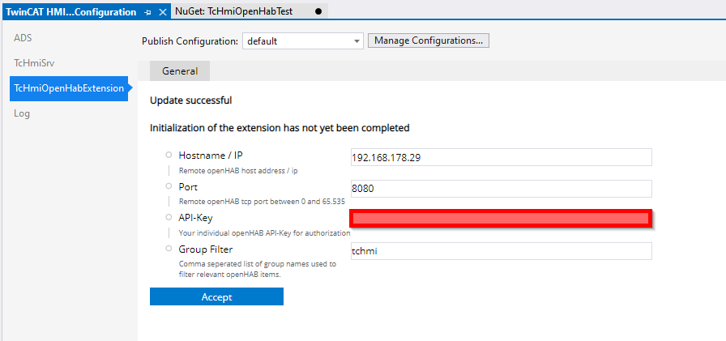
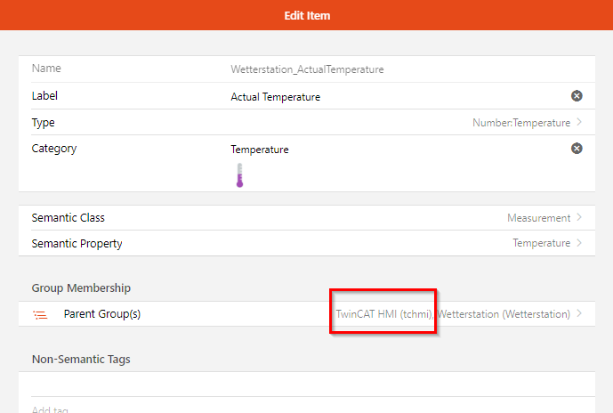
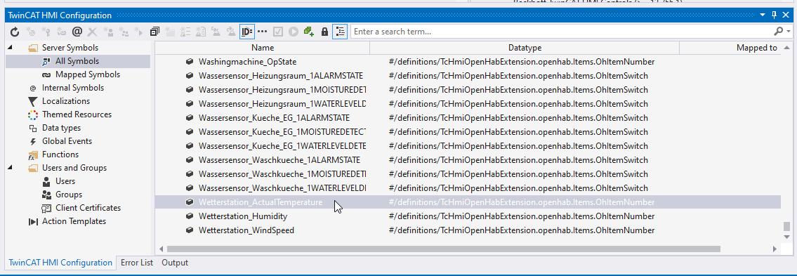
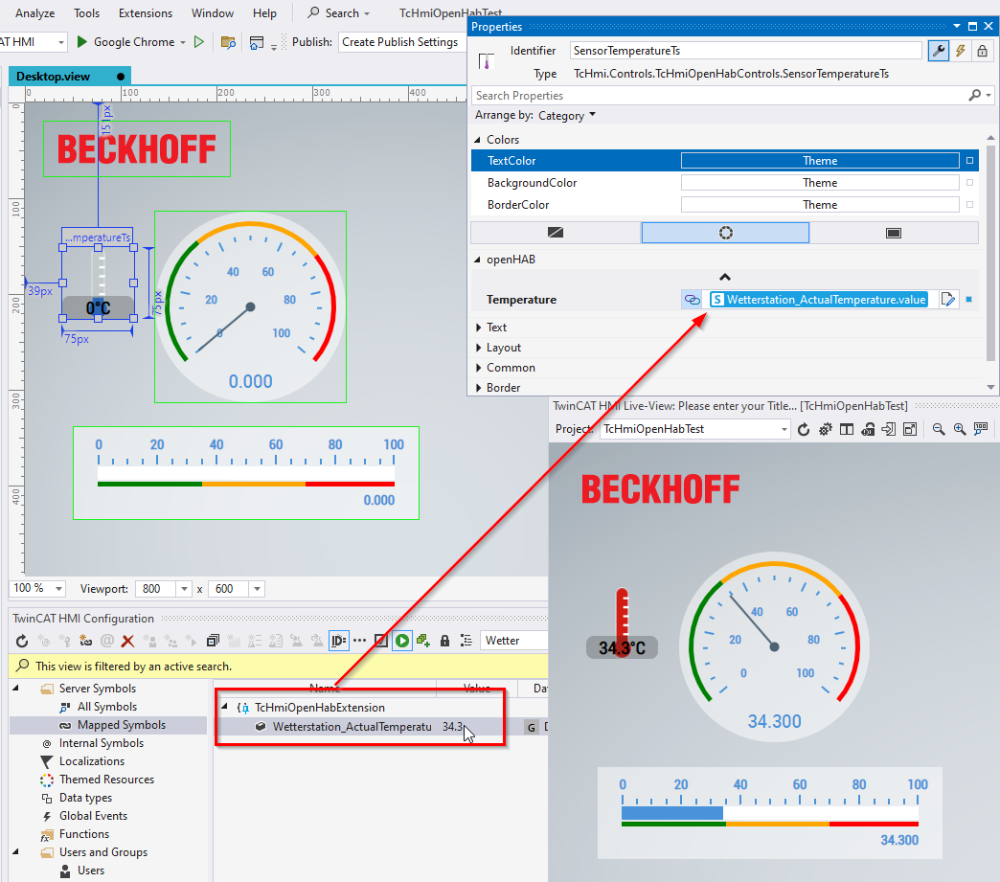

# TwinCAT HMI and openHab

The TwinCAT HMI controls can be added by use of Nuget. 
The link to the packages is: https://www.nuget.org/packages?q=TcHmiOpenHab

- `TcHmiOpenHabExtension` provides the TwinCAT HMI server extension to communicate with the openHab instance
- `TcHmiOpenHabControls` provides several TwinCAT HMI Framework controls to visualize data entities based on the openHab instance, served by `TcHmiOpenHabExtension`

# Preface

This repository is a private software project. Everything which is provided in this repository should not be used in productive systems, and for sure do not use it in safety relevant areas! You use it all on your own risk. 

# Requirements

The NuGet packages work with the TwinCAT HMI 1.12.758 and higher. 
When you clone the source and build the projects on your own several previous versions of the TwinCAT HMI engineering is usable.

- the solution can be opened with VisualStudio 2017 / 2019 / 2022
- the TwinCAT HMI itself works with VisualStudio 2017 / 2019 and Beckhoff's TwinCAT XaeShell

# openHAB

https://www.openhab.org/

# Beckhoff's TwinCAT HMI

The TwinCAT HMI software suite can be directly downloaded from Beckhoff's website:

https://www.beckhoff.com/en-en/products/automation/twincat-3-hmi/

## from Beckhoff's website:

https://www.beckhoff.com/en-en/products/automation/twincat/te1xxx-twincat-3-engineering/te2000.html

> The TwinCAT 3 HMI (human-machine interface) integrates itself into the well-known Visual Studio® development environment. Based on the latest web technologies (HTML5, JavaScript), it allows the user to develop platform-independent user interfaces that are responsive, i.e. they automatically adapt to the screen resolution, size and orientation at hand. With the graphical WYSIWYG (what-you-see-is-what-you-get) editor, controls can be easily arranged via drag-and-drop and linked with real-time variables.
> The HMI is extensible on all levels. Mixing standard controls with custom design elements makes designing your own HMI easy. User controls can also be created and configured by modifying the standard controls to create your own toolbox. To create more complex pages, pre-defined designer templates can be integrated.
> On the client side, the HMI logic can be implemented in JavaScript or as a so-called server extension in .NET, which allows users to protect their know-how.
> TwinCAT 3 HMI Engineering is free of charge.

# Previews

**Fig a)** A real application of a home automation application of TwinCAT HMI in combination with openHAB.

**Fig b)** The TwinCAT HMI engineering, on the top left-hand side the WYSIWYG-editor based on HTML5/JavaScript/TypeScript, on the right-hand side the VisualStudio extended property pane is shown which provides TwinCAT HMI specific property editors (e.g. the blue highigted property is so-called symbol binding to a server extension binding which is linked to a openHAB item), and in the bottom left-hand sid the TwinCAT HMI configuration toolwindow with its possibility to show live symbol binding/openHAB item values.

**Fig c)** An example of a TwinCAT HMI Framework Control for heating setup with a so-called top-most layer as an individual focusable dialog for user interaction.

**Fig d)** Just like **Fig c** but for blind control.

## Installation

For TwinCAT HMI some examples and tutorials exist. Please check your favourite search machine and YouTube, e.g. check the YouTube channel by Oleg Mueller (Link https://www.youtube.com/channel/UCHvABpkd825kAtaDxnhE-tg).

The Beckhoff company provides a good Information platform (Link https://infosys.beckhoff.com/index.php?content=../content/1031/te2000_tc3_hmi_engineering/index.html&id=). In addition you can book your own training (Link https://www.beckhoff.com/en-en/support/training-dates/).

In VisualStudio 2017/2019/2022 you can just add NuGet references to your TwinCAT HMI project. Search with the NuGet manager and just click `Install`:

Once the two packages are added, a new server domain node below "Server\" will be added. Do a doubleblick, the server extension configuration editor will open. You need a **openHAB API Token** for you installation. How this is generated can be read in the openHAB documentation (Link: https://www.openhab.org/docs/configuration/apitokens.html). I you have an ** openHAB API token** just set the relevant data:

The **Group Filter** is similar to the filter for the habpanel items (see forum for this topic, Link: https://community.openhab.org/t/solved-habpanel-sluggish/81756?page=10). This can be configured directly in your openHAB' item files or via the openHAB configuration page:

All openHAB items grouped in your specific group will be listed in the TwinCAT HMI configuration toolwindow:

Click "Map symbol" in context menu and the symbol will be shown below "Mapped Symbols" and can be used in the whole Engineering for any control, directly in the designer:

